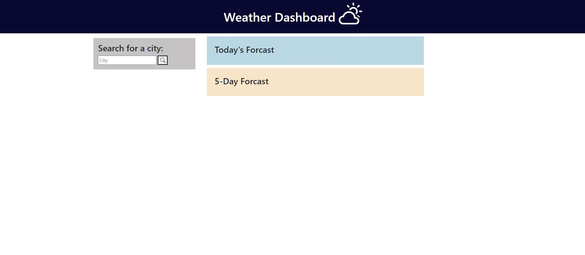

# Weather-Dashboard

## User Story
* As a seasoned traveler I want to know the weather to other cities to figure out what to pack according to the weather trend.

## Description
When completed, the application will accept user input of a city and the application will return the weather data of the inputed city.

Deployed webpage: https://ag6793.github.io/Weather-Dashboard/

## Technologies
* HTML 
* CSS 
* Javascript
* Bootstrap
* Utilizes server side API: Open Weather API

## Installation
Clone the repository and open the HTML document in the browser to use the application.

## Usage
This application will be useful for anyone curious or has the need to check the weather.

## Future Development
* Fix app bug, the search bar isn't working. The user can't search a city, but the app can search via the console.

## Credits
Alexandria Guerrero, https://github.com/Ag6793

## License

MIT License

Copyright (c) [2023] [Alexandria Guerrero]

Permission is hereby granted, free of charge, to any person obtaining a copy
of this software and associated documentation files (the "Software"), to deal
in the Software without restriction, including without limitation the rights
to use, copy, modify, merge, publish, distribute, sublicense, and/or sell
copies of the Software, and to permit persons to whom the Software is
furnished to do so, subject to the following conditions:

The above copyright notice and this permission notice shall be included in all
copies or substantial portions of the Software.

THE SOFTWARE IS PROVIDED "AS IS", WITHOUT WARRANTY OF ANY KIND, EXPRESS OR
IMPLIED, INCLUDING BUT NOT LIMITED TO THE WARRANTIES OF MERCHANTABILITY,
FITNESS FOR A PARTICULAR PURPOSE AND NONINFRINGEMENT. IN NO EVENT SHALL THE
AUTHORS OR COPYRIGHT HOLDERS BE LIABLE FOR ANY CLAIM, DAMAGES OR OTHER
LIABILITY, WHETHER IN AN ACTION OF CONTRACT, TORT OR OTHERWISE, ARISING FROM,
OUT OF OR IN CONNECTION WITH THE SOFTWARE OR THE USE OR OTHER DEALINGS IN THE
SOFTWARE.